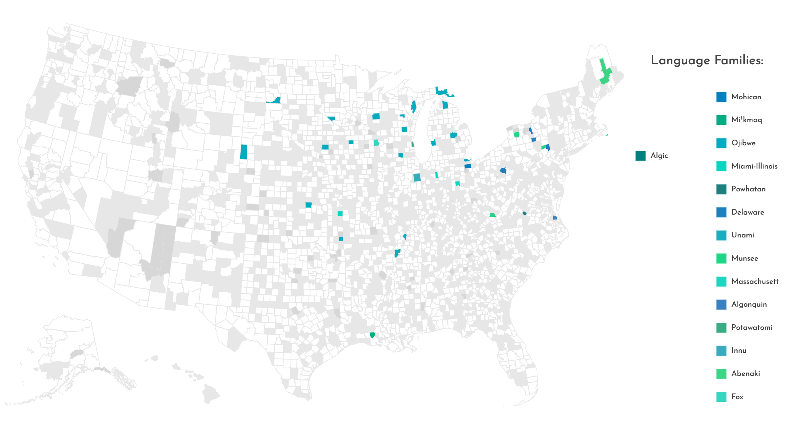
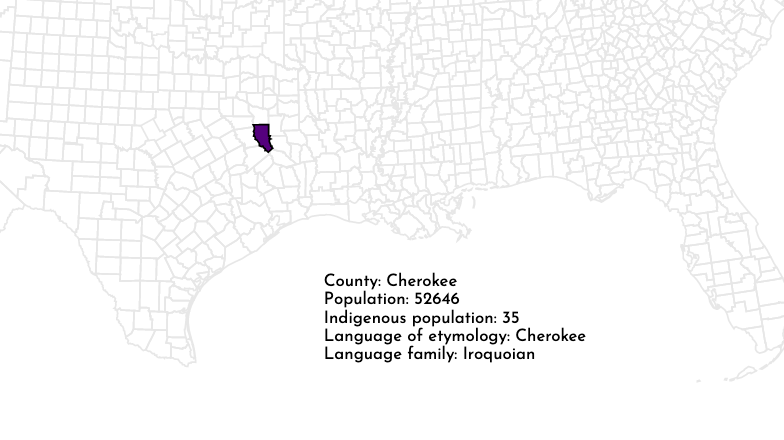
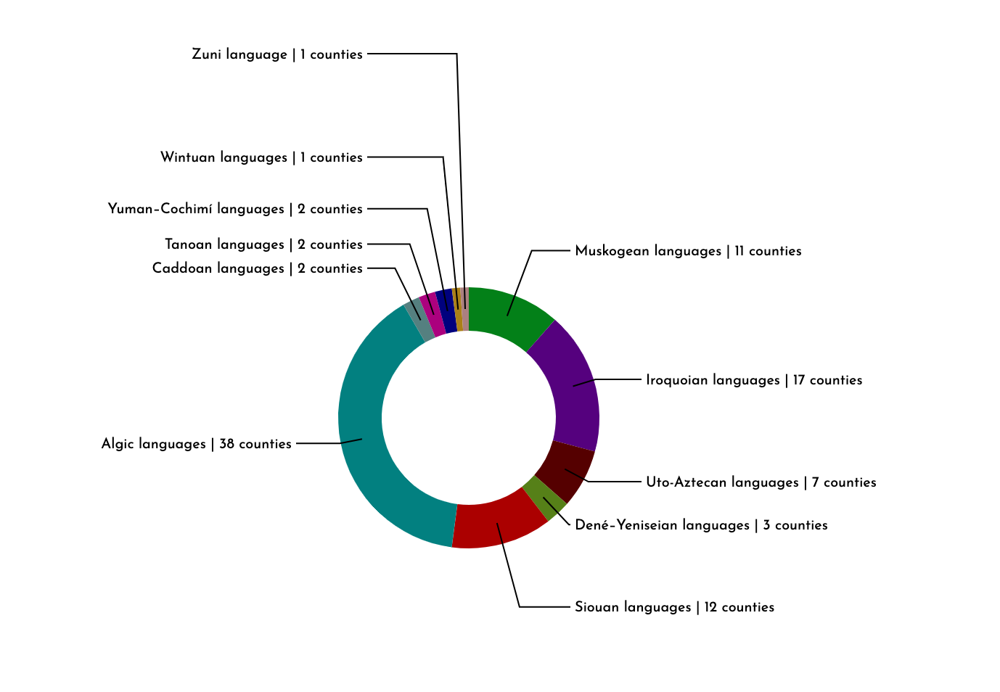

# Live Demo

View live on **Github Pages** [here](https://zalmankelber.github.io/CountyScraper/).

# Overview

## Web Scraper

Using python's **urllib** and the **Beautiful Soup** library, this scrape occurs in several stages.  First, a list of US counties is searched on **Wiktionary**.  If there is an Etymology Section on the Wiktionary page, the languages listed in the Etymology are stored in a **SQLite** databse.  In the next phase, the list of all languages is collected and the **Wikipedia** article for each language is accessed.  On these pages, the language family that the language belongs to (e.g. Indo-European, Iroquoian, &c.) is determined.  In the next phase, the Wikipedia articles for the language family are accessed, and the information for the geographical expanse of that language family is collected and stored.  These terms are then used as search queries in a version of the **Google Maps API** available from the University of Michigan [Python for Everybody](https://online.umich.edu/series/python-for-everybody/) course in order to determine whether or not the language in question is an Indigenous language of North America.

## Visualization

Using a **unidirectional dataflow** application model without a framework like React, this simple web application uses the **D3 JS** library along with some **Bootstrap** to render two visualizations: a chart (using TopoJson data) that shows the counties determined to have Indigenous etymologies color-coded by language and language family (along with some other maps that show some census information related to the Indigenous population of the US).  The colors are assigned by use of a function that returns a given number of colors so that they are evenly and maximally distributed across the rgb cube.  An interactive donut chart shows the percentage of US counties with Indigenous etymologies according to some different criteria.

# Instructions for replicating

To replicate this project, or to modify the search query for different years or time ranges, download the repository and make sure that SQLite is installed.  You will need to have Beautiful Soup installed *in the parent directory* of wherever the repository is saved.  Alternatively, install bs4 in the same directory or system wide and simply delete the following code from `county_scraper.py`

```
import os,sys,inspect
current_dir = os.path.dirname(os.path.abspath(inspect.getfile(inspect.currentframe())))
parent_dir = os.path.dirname(current_dir)
sys.path.insert(0, parent_dir)
```

Run `county_scraper.py` and then `load_json.py` in succession on the command line.  Note that the JSON data in the `js` folder will be overwritten by the last program.  To view the visualization, simply open up `index.html` in any web browser.

# About

## Visualizations

To highlight selected counties on the map, either click on the county itself to display information (which should appear where the Gulf of Mexico is on the map) or else click one of the language families or languages in order to highlight the counties with etymologies in that category.




To use the donut chart, simply select the various display options from the dropdown menu.



## Some interesting takewaways from the data

* The counties that were found to have Indigenous etymologies seem to be more or less evenly/randomly distributed around the US despite the fact that the current US Indigenous population has a much greater presence in specific regions of the country.

* At a high level, the geographic distributions of counties, when organized by language family tends to coincide with the geographic distribution of those language families.  But on a lower level, individual counties are often far removed from the area in which the language they are named from was spoken.  Part of this may be the result of various exonyms being applied to languages in peoples (for example, "Iroquois" is a word of Innu origin).

# Issues and Bugs

## Regarding the data

* Unfortunately, many Wiktionary articles for county names simply do not contain etymologies.  We may speculate that the ones without etymologies are more likely to be less common names and thus more likely to be derived from Indigenous languages.

* A potential problem that was fortunately avoided involves using the Google Maps API to search the geographic expanse of language families to determine if they are from North America.  At least two language families Indigenous to North America (Eskimo-Aleut and the proposed Dene-Yeniseian) are spoken in East Asia as well.  Fortunately the program detects them as belonging to North America.

## Regarding the visualization

* Both zoomable visualizations do not work well on mobile.

* The javaScript transition in the donut chart does not maintain the circular shape of the chart.
